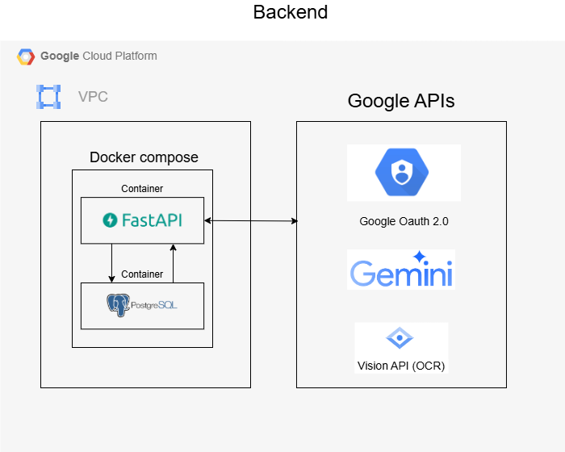
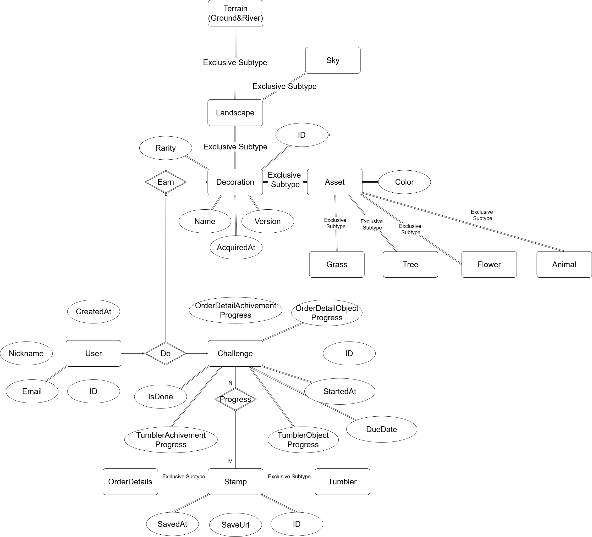
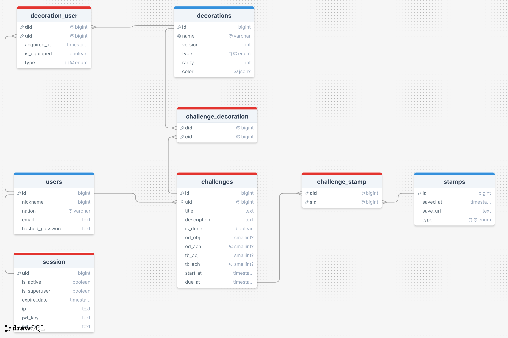

# Kkook - Environmental Action Gamification (SDGP-Team3-Backend & AI)

Kkook is a gamification platform that encourages users to adopt environmentally friendly habits by reducing disposables and increasing tumbler usage.

https://github.com/user-attachments/assets/1dac0d2a-e1bc-47c9-b7ce-8b18ebd95982

## Team Members
- Euntae Kim (https://github.com/ket0825)
- Junghwan Mun (https://github.com/jhmun0206)

## Project Description
- Backend for the Kkook(SDGP Team 3 project), which includes user authentication, challenge management, decoration management, and stamp management.
- Kkook contributes to users' environmental actions through gamification that encourages users to reduce disposable item usage and increase tumbler usage.
- Users can earn stamps by using their tumbler and reducing disposables and complete challenges to earn rewards.
- Users can also decorate "My World" with the rewards they earned.

## Tech Stack
- **Framework**: FastAPI (without ORM)
- **Database**: PostgreSQL
- **Containerization**: Docker & Docker Compose
- **Authentication**: OAuth2 with Google
- **AI Integration**:
  - Vision API for verifying no disposables in order details/bills
  - Gemini API for detecting tumblers in images
- **DevOps**:
  - GitHub Actions for CI/CD
  - Pre-commit hooks for code style checks
- **Deployment**: Google Cloud Platform (GCE)

## Project Features
- Secure user authentication using OAuth2 with Google
- Challenge and reward system to encourage environmental actions
- Stamp verification using AI to validate environmentally friendly behaviors
- Virtual world decoration system as rewards for completing challenges
- Fully containerized development and production environments
- Automated lint and deployment pipeline

## System Architecture


## Database Design
### ERD


### DB Schema


## Demo
### Prerequisites
- Python 3.9+
- Poetry
- Docker & Docker Compose
```bash
# Install Poetry if not installed
curl -sSL https://install.python-poetry.org | python3 -
# Clone the repository
git clone https://github.com/yourusername/SDGP_team3_BE.git
cd SDGP_team3_BE
# Install Dependencies
poetry install
# Activate virtual environment
poetry shell
# Install and run pre-commit hooks
poetry run pre-commit install

# Create .env.test file
cat > .env.test << EOF
# Project Information (Optional)
PROJECT_NAME=Kkook Backend
PROJECT_VERSION=1.0.0

# PostgreSQL Database Configuration
POSTGRES_USER=postgres
POSTGRES_PASSWORD=your_secure_password
POSTGRES_SERVER=db  # Service name when using Docker Compose
POSTGRES_PORT=5432
POSTGRES_DB=kkook_db

# JWT Authentication Settings
SECRET_KEY=your-super-secret-key-should-be-long-and-random
ACCESS_TOKEN_EXPIRE_MINUTES=30

# Google OAuth Configuration
GOOGLE_CLIENT_ID=your_google_client_id
GOOGLE_CLIENT_SECRET=your_google_client_secret
GOOGLE_REDIRECT_URI=http://localhost:8000/api/google/callback

# Session Middleware Settings
SESSION_SECRET_KEY=another-secure-random-key-for-sessions

# Google AI API Configuration
GOOGLE_API_KEY=your_google_api_key_for_gemini
EOF

# Start development environment
deploy/run_in_test.sh


```

## Project Structure
```
SDGP_team3_BE
├─ .dockerignore
├─ .pre-commit-config.yaml
├─ .python-version
├─ Dockerfile
├─ README.md
├─ app
│  ├─ __init__.py
│  ├─ config.py
│  ├─ controllers
│  │  ├─ __init__.py
│  │  ├─ challenge_controller.py
│  │  ├─ decoration_controller.py
│  │  ├─ decoration_user_controller.py
│  │  ├─ google_controller.py
│  │  ├─ stamp_controller.py
│  │  ├─ user_controller.py
│  │  └─ vision_controller.py
│  ├─ core
│  │  ├─ __init__.py
│  │  ├─ auth.py
│  │  ├─ oauth.py
│  │  └─ security.py
│  ├─ database
│  │  ├─ __init__.py
│  │  ├─ database.py
│  │  └─ fake_data.py
│  ├─ dependencies
│  │  ├─ __init__.py
│  │  └─ auth.py
│  ├─ dto
│  │  ├─ __init__.py
│  │  └─ user_dto.py
│  ├─ main.py
│  ├─ models
│  │  ├─ __init__.py
│  │  ├─ challenge_model.py
│  │  ├─ challenge_stamp_model.py
│  │  ├─ decoration_model.py
│  │  ├─ decoration_user_model.py
│  │  ├─ stamp_model.py
│  │  └─ user_model.py
│  ├─ repositories
│  │  ├─ __init__.py
│  │  ├─ challenge_repository.py
│  │  ├─ challenge_stamp_repository.py
│  │  ├─ decoration_repository.py
│  │  ├─ decoration_user_repository.py
│  │  ├─ stamp_repository.py
│  │  └─ user_repository.py
│  └─ services
│     ├─ __init__.py
│     ├─ challenge_service.py
│     ├─ decoration_service.py
│     ├─ decoration_user_service.py
│     ├─ google_service.py
│     ├─ stamp_service.py
│     ├─ user_service.py
│     └─ vision_service.py
├─ deploy
│  ├─ run_in_production.sh
│  └─ run_in_test.sh
├─ docker-compose-production.yml
├─ docker-compose-test.yml
├─ migrations
│  ├─ migrate.py
│  ├─ run_docker_postgres.sh
│  └─ sql
│     ├─ 001_create_users_table.sql
│     ├─ 002_add_is_superuser_column.sql
│     ├─ 003_create_decorations_table.sql
│     ├─ 004_create_challenges_table.sql
│     ├─ 005_create_stamps_table.sql
│     ├─ 006_create_decoration_user_table.sql
│     ├─ 007_create_challenge_decoration_table.sql
│     └─ 008_create_challenge_stamp_table.sql
├─ poetry.lock
├─ pyproject.toml
├─ static
└─test
   ├─ __init__.py
   ├─ conftest.py
   ├─ test_controllers
   │  ├─ __init__.py
   │  └─ test_user_controller.py
   ├─ test_repositories
   │  ├─ __init__.py
   │  └─ test_user_repository.py
   └─ test_services
      ├─ __init__.py
      └─ test_user_service.py
```
